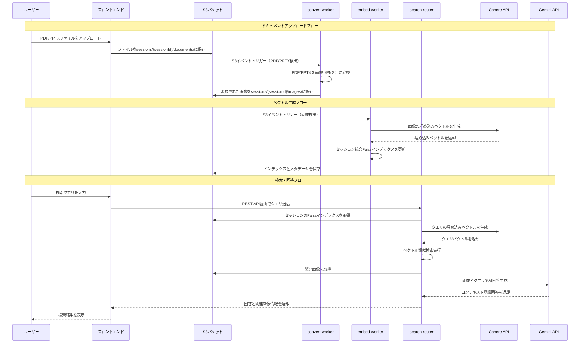

# Vision RAG App

AWS Amplify Gen 2で構築されたVision RAG（検索拡張生成）アプリケーション。PDF/PPTXドキュメントを画像に変換し、ベクトル埋め込みを生成して、AIによる回答機能付きのセマンティック検索を実現します。

## 必要な環境

- Node.js 18+ および npm
- 適切な権限で設定されたAWS CLI
- Docker（Lambdaコンテナビルド用）
- CohereとGoogle Gemini のAPIキー

## クイックスタート

### 1. リポジトリのクローンと依存関係のインストール

```bash
git clone <repository-url>
cd vision-rag-app
npm install
```

### 2. 環境変数の設定

環境変数テンプレートをコピーしてAPIキーを追加：

```bash
cp .env.example .env
```

`.env`ファイルを編集して実際のAPIキーを設定：

```bash
# 埋め込み生成用のCohere APIキー
# キーの取得先: https://dashboard.cohere.com/api-keys
COHERE_API_KEY=your_cohere_api_key_here

# AI回答生成用のGoogle Gemini APIキー
# キーの取得先: https://makersuite.google.com/app/apikey
GEMINI_API_KEY=your_gemini_api_key_here
```

### 3. AWS認証の設定

AWS CLIで認証情報を設定：

```bash
aws configure
```

以下の情報が必要です：
- AWS アクセスキー ID
- AWS シークレットアクセスキー
- デフォルトリージョン（推奨: `ap-northeast-1`）
- デフォルト出力形式: `json`

### 4. Amplifyサンドボックスへのバックエンドデプロイ

個人用Amplifyサンドボックスを初期化・デプロイ：

```bash
npx ampx sandbox --profile <your-aws-profile>
```

これにより以下が実行されます：
- AWSリソースの作成（S3、Lambda、API Gatewayなど）
- LambdaファンクションコンテナのECRへのデプロイ
- フロントエンド設定用の`amplify_outputs.json`生成

### 5. 開発サーバーの起動

```bash
npm run dev
```

アプリケーションは`http://localhost:3000`で利用できます。

## APIキーの設定ガイド

### Cohere APIキー
1. [Cohere Dashboard](https://dashboard.cohere.com/api-keys)にアクセス
2. アカウントにサインアップまたはログイン
3. API Keysセクションに移動
4. 新しいAPIキーを生成
5. キーを`.env`ファイルにコピー

### Google Gemini APIキー
1. [Google AI Studio](https://makersuite.google.com/app/apikey)にアクセス
2. Googleアカウントでサインイン
3. 新しいAPIキーを作成
4. キーを`.env`ファイルにコピー

## 必要なAWS権限

AWSユーザー/ロールには以下の権限が必要です：
- S3: バケットの作成、オブジェクトのアップロード/ダウンロード
- Lambda: 関数の作成、実行ロールの管理
- ECR: コンテナイメージのプッシュ
- API Gateway: REST APIの作成
- CloudWatch: ログループの作成
- IAM: サービスロールの作成と管理

## 開発コマンド

### フロントエンド開発
```bash
npm run dev          # Turbopack付きNext.js開発サーバー起動
npm run build        # プロダクション用フロントエンドビルド
npm run lint         # ESLint実行
npm run start        # プロダクションサーバー起動
```

### バックエンド開発
```bash
npx ampx sandbox     # 個人用サンドボックスにAmplifyバックエンドをデプロイ
npx ampx generate    # フロントエンド用クライアントコード生成
```

### Lambda関数の更新
Lambda関数コードを変更した場合、リビルドして再デプロイ：

```bash
# 特定の関数コンテナをリビルド
./scripts/rebuild-convert-worker.sh   # ドキュメント変換用
./scripts/rebuild-embed-worker.sh     # 埋め込み生成用
./scripts/rebuild-search-router.sh    # 検索API用

# 更新をデプロイ
npx ampx sandbox
```

### サンプルドキュメントのセットアップ
```bash
npm run setup-samples  # サンプルドキュメントをS3にアップロード
```

## アーキテクチャ概要

アプリケーションはセッションベースの分離を持つサーバーレスパイプラインを使用：

### システムフロー



### 主要コンポーネント

1. **ドキュメントアップロード** → S3バケット（`sessions/{sessionId}/documents/`）
2. **画像変換** → `convert-worker` Lambda（PDF/PPTX → PNG）
3. **ベクトル生成** → `embed-worker` Lambda（画像 → Faissインデックス）
4. **検索・回答** → `search-router` Lambda（クエリ → AI回答）

### 主要な機能
- **セッションベース分離**: 各ブラウザセッションが独立したストレージを持つ
- **ドキュメント処理**: 自動的なPDF/PPTXから画像への変換
- **ベクトル検索**: Cohere埋め込みを使用したセマンティック類似検索
- **AI回答**: Google Gemini Vision Proを使用したコンテキスト認識回答
- **サンプルドキュメント**: 即座にテストできる前処理済みドキュメント

## トラブルシューティング

### よくある問題

**1. "AWS credentials not found"**
```bash
aws configure list  # 認証情報が設定されているか確認
aws sts get-caller-identity  # AWSアクセスを確認
```

**2. "Lambda function deployment failed"**
- Dockerが実行されているか確認
- ECRとLambdaのAWS権限を確認
- 関数コンテナのリビルドを試行

**3. "API keys not working"**
- キーが`.env`で正しく設定されているか確認
- APIキーの権限とクォータを確認
- `.env`の値に末尾スペースがないか確認

**4. "Sandbox deployment stuck"**
```bash
npx ampx sandbox delete  # サンドボックスを削除して再作成
npx ampx sandbox
```

**5. "Frontend build errors"**
```bash
rm -rf .next node_modules package-lock.json
npm install
npm run build
```

### 開発のヒント

- 特定のAWSプロファイルを使用する場合: `npx ampx sandbox --profile <profile>`
- Lambdaログの確認: `aws logs tail /aws/lambda/<function-name> --since 10m`
- デバッグ用にAWSコンソールでS3バケットの内容を監視
- セッションデータは24時間後に自動期限切れ（`amplify/backend.ts`で設定可能）

## 貢献方法

1. リポジトリをフォーク
2. フィーチャーブランチを作成: `git checkout -b feature-name`
3. 変更を加えて十分にテスト
4. リンティング実行: `npm run lint`
5. プルリクエストを提出

## ライセンス

このプロジェクトはMITライセンスの下でライセンスされています。
